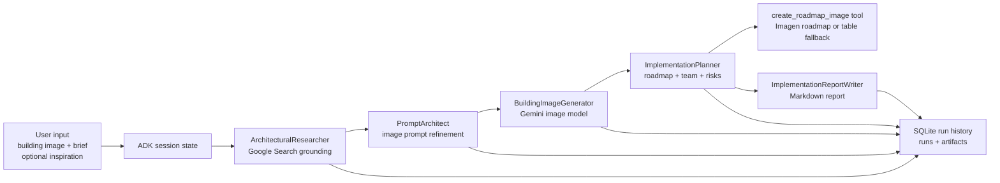

# SECO Facade Designer Agent

An AI-assisted facade ideation MVP for SECO Luxembourg. The tool takes an existing
building image, a redesign brief, and optionally an inspiration image, then produces:

- a generated facade concept image;
- an improved image-generation prompt;
- an implementation planning report;
- a roadmap diagram or fallback roadmap table;
- a run-history record with agent outputs and saved artifact paths.

The project is built with Google ADK, Gemini image/text models on Vertex AI, and a
Streamlit front end.

## Problem and Users

Facade transformation projects are hard to imagine before involving specialist
consultants. Clients often arrive with a rough idea, a photo, a reference image, or a
desired style, but they may not yet understand the design direction, implementation
steps, technical studies, team roles, budget implications, or constraints.

This MVP helps three groups:

- **Prospective SECO clients** who want a first visual and planning idea before
  contacting facade specialists.
- **SECO facade experts** who can use the generated concept as an early discussion
  support, not as a final technical recommendation.
- **Business and communication teams** who want an innovative website tool that
  increases visibility, improves user engagement, and positions SECO as a technology
  leader in construction consultancy.

The goal is not to replace expert facade engineering. The goal is to turn a vague
initial request into a structured first conversation.

## Why This Matters to SECO

SECO Expert Facade presents its facade activity as technical assistance for building
envelopes and facades, with attention to quality, budget, deadlines, design support,
realization support, audit/expertise, and collaboration with architects, engineers,
contractors, facade fabricators, and material manufacturers:
https://groupseco.lu/fr/seco-expert-facade

This product direction matches that mission:

- It gives clients a guided first step before requesting expert support.
- It makes facade expertise more visible and approachable.
- It can highlight the complexity behind a facade decision: aesthetics, structure,
  thermal performance, fire safety, waterproofing, acoustics, maintenance, procurement,
  approvals, and quality control.
- It can later connect to SECO internal knowledge, expert guardrails, supplier data,
  certification expectations, and budget estimation workflows.

In short: it is a digital pre-consultation layer that can route better-prepared users
toward SECO's real facade expertise.

## What the MVP Does

1. The user uploads an existing building image.
2. The user writes a short facade redesign brief.
3. The user optionally uploads an inspiration image.
4. The agent pipeline researches context, improves the prompt, generates a new facade
   image, and creates an implementation plan.
5. The UI shows the generated image, roadmap, planning report, visible agent trace,
   output files, and run-history ID.

## Agent Flow



## Repository Structure

```text
.
├── main.py                  # CLI entry point
├── streamlit_app.py          # Streamlit front end
├── config.yaml               # Central runtime configuration
├── requirements.txt          # Python dependencies
├── scripts/
│   ├── agent.py              # ADK agent definitions and root SequentialAgent
│   ├── config.py             # YAML config loader
│   ├── history_store.py      # SQLite run/artifact history
│   ├── image_generator.py    # Building image generation call
│   ├── pipeline.py           # Shared CLI/Streamlit runner
│   ├── planning_tools.py     # Roadmap image tool
│   └── prompting.py          # Agent instructions and prompt helpers
├── data/                     # Example local inputs
└── outputs/                  # Generated files and SQLite history DB
```

`outputs/` is ignored by Git because it contains generated images, reports, notes, and
the SQLite history database.

## Data Sources

The MVP uses a small set of inputs by design:

- **User-provided building image**: the primary visual source for the existing facade.
- **User-provided design brief**: the intent, theme, constraints, and desired change.
- **Optional inspiration image**: a style reference for materiality, rhythm, tone, or
  facade language.
- **Google Search grounding**: used by the research and planning agents when current or
  local context is useful.
- **SECO facade expertise page**: used as product-positioning context for the README and
  future domain alignment, especially around facade assistance, technical studies,
  quality, budget, delays, and collaboration.
- **Generated artifacts**: prompt, image, model notes, implementation plan, roadmap, and
  Markdown report are saved to outputs and history.

Current limitation: the MVP does not yet ingest SECO internal technical documents,
supplier catalogs, inventory prices, certification rules, or expert review checklists.
Those are intended future data sources.

## Technical Decisions and Trade-Offs

### Google ADK Sequential Agent

The root agent is a simple `SequentialAgent`:

1. research;
2. prompt refinement;
3. image generation;
4. implementation planning;
5. Markdown report writing.

This is intentionally simple. It keeps the first MVP understandable and easy to debug.
The trade-off is that the flow is linear and does not yet include human approval loops,
branching, or automatic retry strategies.

### Custom Image Generation Agent

Image generation is implemented as a custom ADK `BaseAgent` because the image model call
needs to handle local image files, output paths, prompt saving, model notes, and Vertex AI
configuration. This keeps the image-generation logic separate from text-only LLM agents.

### Roadmap Tool

The implementation planner can call `create_roadmap_image`. The tool asks Imagen to create
a roadmap diagram. If image generation fails, it returns a Markdown table of steps and
durations instead of failing the whole pipeline.

Trade-off: the Imagen roadmap may not always render text perfectly. The fallback table is
less visually attractive but more reliable.

### SQLite History

Run history is stored in SQLite:

- `runs`: metadata, status, prompt, model names, timestamps, final text;
- `artifacts`: agent text outputs, image paths, prompt/report files, roadmap table, notes.

Images are stored by file path rather than as binary blobs. This keeps the DB lightweight
and easy to inspect, but it means output files must remain available on disk or in the
same storage layer.

### Central YAML Config

Runtime settings live in `config.yaml`: app name, agent names, models, Vertex AI settings,
generation options, and history settings. This is easier to control than scattering
environment variables across the codebase.

Environment variables are still used for Google Cloud project/location fallback where
needed.

## Configuration

Example:

```yaml
models:
  text: gemini-3.5-flash
  image: gemini-2.5-flash-image

vertex:
  use_vertex_ai: true
  project: your-gcp-project
  location: global
  api_version: v1

generation:
  output_dir: outputs
  aspect_ratio: "16:9"
  image_size: 2K

history:
  enabled: true
  db_path: outputs/run_history.sqlite
```

## GCP and Vertex AI Runtime

This solution is intended to run on Google Cloud Platform with Vertex AI APIs enabled.
In that setup, no API key is needed. Authentication is handled by the GCP runtime and
its service account, as long as the selected project has the required APIs enabled and
the service account has permission to call Vertex AI / Gemini models.

Practical setup notes:

- Create or select a Google Cloud project.
- Enable the required Vertex AI / Generative AI APIs for that project.
- Make sure billing is active.
- Run the app from a GCP environment or with Application Default Credentials locally.
- Set the project and location in `config.yaml` or through environment variables.

For experimentation, a new Google Cloud account may be eligible for Google's free trial
program, commonly advertised as a limited-time trial with Cloud Billing credits. This is
useful for trying different Gemini / Imagen models before deciding which model setup is
best for the product. Always check the current Google Cloud Free Program terms because
trial duration, credits, eligible services, and billing rules can change:
https://docs.cloud.google.com/free/docs/free-cloud-features

## Run Locally

Install dependencies:

```bash
python3 -m venv .venv
source .venv/bin/activate
pip install -r requirements.txt
```

Run the Streamlit app:

```bash
streamlit run streamlit_app.py
```

Run from CLI:

```bash
python main.py \
  --building data/Luxembourg_Ministere_de_economie.jpg \
  --inspiration data/inspiration.jpg \
  --prompt "$(cat data/input_prompt)"
```

After a run, check:

- generated facade image in `outputs/`;
- roadmap image or table;
- Markdown report;
- prompt and model notes;
- SQLite run history at `outputs/run_history.sqlite`.

## Inspect Run History

```bash
sqlite3 outputs/run_history.sqlite "select run_id, status, created_at, finished_at from runs order by created_at desc limit 5;"
```

```bash
sqlite3 outputs/run_history.sqlite "select agent_name, artifact_type, name, path from artifacts where run_id = 'RUN_ID_HERE';"
```

## What Goes to Production Tomorrow

Keep:

- The clear user journey: upload building, optional inspiration, brief, generated concept,
  planning report.
- The sequential ADK architecture as a first production baseline.
- The Streamlit prototype for demos and expert feedback.
- The run-history database concept, because traceability matters for expert review.
- Central YAML configuration.
- Vertex AI authentication through GCP service accounts.

Improve before production:

- Persist files in Cloud Storage instead of local `outputs/`.
- Move history from SQLite to a managed database if multi-user concurrency is needed.
- Add authentication, user/project ownership, and data-retention rules.
- Add moderation and privacy controls for uploaded building images.
- Add stronger error handling and retry logic for model calls.
- Add expert review states: draft, reviewed, approved, rejected, archived.

## What to Throw Away or Replace

Replace:

- Local temporary file handling for uploads.
- Local-only SQLite if the product becomes multi-user or customer-facing.
- Generic web search as the only external knowledge source.
- Free-form planning output as the only quality control layer.
- Streamlit if the target is a polished public website experience.

Keep only as prototype:

- The current roadmap image generator. It is useful for the MVP, but production should
  use a more deterministic diagram renderer or a controlled visual template.

## Three-Month Product Vision

With three more months, this could become a guided SECO facade pre-consultation product:

- A polished web interface embedded on the SECO website.
- Project intake forms for building type, location, facade area, constraints, target
  performance, budget range, and planning horizon.
- Multiple design variants with comparison: conservative, premium, sustainable,
  disruptive, low-disruption retrofit.
- Budget estimation connected to inventory price databases, supplier catalogs, and
  facade-system families.
- Supplier comparison across cost, lead time, quality level, availability, maintenance,
  sustainability, and certification fit.
- An inspector agent that reviews the generated report against SECO expert guardrails,
  internal documentation, quality certification expectations, and regulatory constraints.
- Expert-facing dashboard with run history, client inputs, generated outputs, review
  notes, and approval workflow.
- Exportable client pre-study PDF with concept image, assumptions, risks, next steps,
  and a clear invitation to contact SECO facade experts.

## Future Expert Knowledge Layer

The next important product layer is SECO-owned knowledge. This would require documents
and structured data from SECO teams, for example:

- facade expertise checklists;
- quality certification expectations;
- inspection and audit templates;
- technical guardrails by facade family;
- internal report standards;
- supplier and material references;
- budget and inventory price data;
- risk patterns from previous facade projects.

Once this knowledge is available, the planner agent can become more than a generic
planning assistant. It can become a SECO-aligned pre-study assistant.

## Current Limitations

- Generated designs are conceptual and must not be treated as engineering drawings.
- Estimated durations are indicative planning ranges, not committed schedules.
- Budget estimation is not implemented yet.
- The roadmap image depends on an image model and may sometimes produce imperfect text.
- No SECO internal technical knowledge base is connected yet.
- No deterministic expert validation workflow exists yet.

## Motivation

This MVP is both a product experiment and a visibility tool. A public-facing AI facade
assistant can make SECO expertise easier to discover, help clients formulate better
requests, and reinforce SECO's image as an innovative consultancy that combines human
expertise with modern digital tools.

The strongest version of the product is not an AI replacing specialists. It is an AI that
helps clients arrive at the specialist conversation with better context, better questions,
and a clearer first vision.
