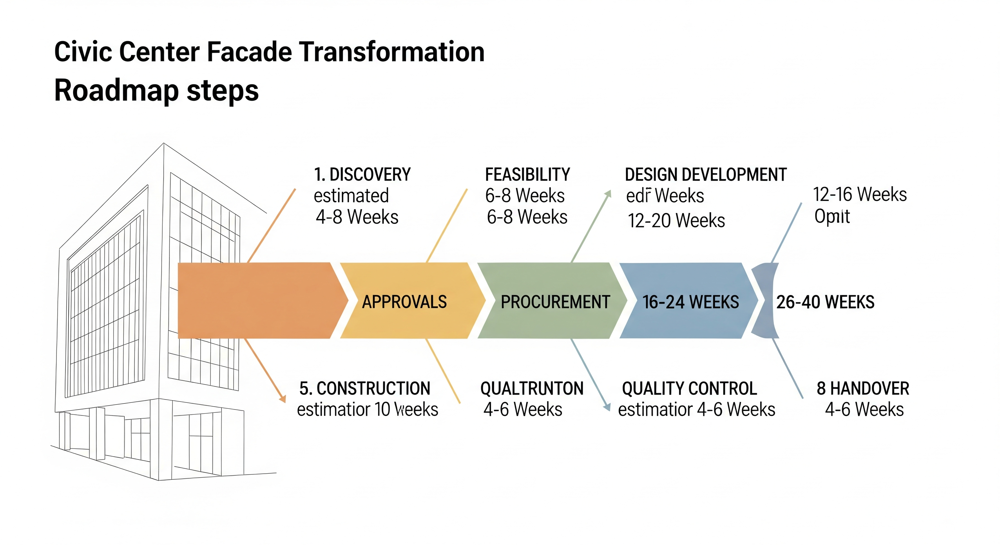
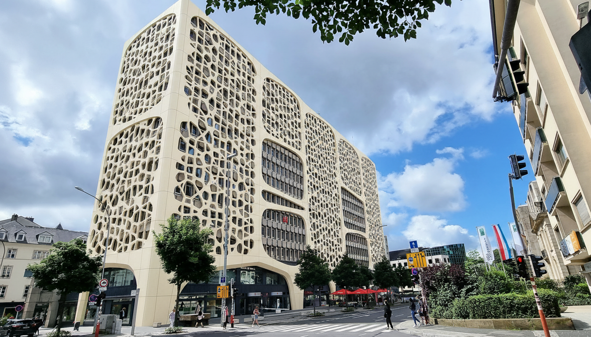

# Facade Transformation Implementation Report

## Roadmap



# Facade Transformation Implementation Plan

This report outlines the delivery roadmap, technical considerations, and procurement strategies required to turn the conceptual double-skin facade redesign of the civic institution into a built reality. 

---

## 1. Roadmap: Delivery Phases

The diagram below illustrates the strategic sequence and indicative timeline for executing this highly advanced facade redesign. 

### Delivery Phase Overview Diagram


### Schedule Table
| Step | Phase | Indicative Duration Range | Primary Purpose & Key Milestone |
|:---|:---|:---|:---|
| 1 | **Discovery** | 4–6 Weeks | Structural audit, laser scanning of host structure, and alignment of client objectives. |
| 2 | **Feasibility** | 6–8 Weeks | Parametric optimization, initial structural engineering viability, and cost-benefit analysis. |
| 3 | **Design Development** | 12–16 Weeks | Detailed geometry modeling, substructure engineering, and 1:1 joint detailing. |
| 4 | **Approvals** | 12–20 Weeks | Permitting, municipal planning reviews, and third-party safety certifications (fire/wind). |
| 5 | **Procurement** | 16–24 Weeks | Fabricator selection, mold manufacturing, and raw material sourcing ($TiO_2$, UHPC/GFRC). |
| 6 | **Construction** | 26–40 Weeks | On-site bracket installation, curtain wall assembly, and lattice panel hanging. |
| 7 | **Quality Control** | 4–6 Weeks | Inspection of alignment, waterproofing checks, $TiO_2$ performance validation. |
| 8 | **Handover** | 4–6 Weeks | Commissioning of cavity wash-lighting, maintenance training, and project sign-off. |

---

## 2. Concept Summary

The proposed design reimagines the civic institution's envelope with an innovative, expressive, and high-performance skin while respecting the underlying architectural geometry.

### What Is Changing
*   **The Outer Layer:** Introduction of a lightweight, highly porous, self-supporting geometric lattice composed of Ultra-High Performance Concrete (UHPC). It features a parametric gradient of varying aperture sizes that dynamically transitions into softly curved, solid Glass Fiber Reinforced Concrete (GFRC) panels wrapping around the building's corners.
*   **The Cavity:** Creation of a deep (0.5m to 1.5m) buffer space between the layers, incorporating dynamic shadow play and integrated, soft LED wash-lighting within the cavity for a nocturnal civic presence.
*   **The Inner Layer:** A high-performance, dark-tinted double or triple-glazed curtain wall recessed behind the lattice, which dramatically enhances the visual depth and controls thermal gains.
*   **Material Surface:** Treatment of the ivory-colored concrete surfaces with a photocatalytic Titanium Dioxide ($TiO_2$) self-cleaning coating.

### What Is Preserved
*   **Structural Grid & Rhythm:** The original building's floor levels, structural floor rhythm, and structural columns remain structurally intact.
*   **Site Geometry:** The exact perspective, building footprint, site context boundaries, and massing lines are strictly maintained to respect the urban fabric.

---

## 3. Detailed Delivery Phases

### Phase 1: Discovery (4–6 Weeks)
*   **Activities:** Execute a high-precision 3D LiDAR scan of the existing building to map out structural tolerances. Review old structural drawings and verify load-bearing capacity. 
*   **Milestone:** Complete "As-Built" digital twin and structural capacity validation report.

### Phase 2: Feasibility (6–8 Weeks)
*   **Activities:** Kick off the parametric scripting of the UHPC lattice. Analyze local solar radiation patterns to optimize the bioclimatic aperture sizes. Perform initial wind load simulations and structural static analysis.
*   **Milestone:** Feasibility sign-off, confirming panel thickness (target 80–110 mm for UHPC) and maximum weight parameters.

### Phase 3: Design Development (12–16 Weeks)
*   **Activities:** Resolve panel jointing, panelization schemes, and secondary steel support structures. Design "invisible" color-matched steel bracketry. Complete structural shop drawings for CNC-milled molds.
*   **Milestone:** 100% Construction Documents (CD) and coordinated BIM model.

### Phase 4: Approvals (12–20 Weeks)
*   **Activities:** Submit planning and zoning applications. Secure structural permit approvals. Execute third-party fire testing compliance (such as ASTM E119 for 2-hour rating).
*   **Milestone:** Municipal building permits and code compliance certificates issued.

### Phase 5: Procurement (16–24 Weeks)
*   **Activities:** Tender fabrication to specialist precast concrete fabricators. Build CNC-milled molds for double-curved GFRC cassettes. Cast first-off mockups.
*   **Milestone:** Production-ready physical mockup approved; raw materials secured.

### Phase 6: Construction (26–40 Weeks)
*   **Activities:** Install structural back-wall system, followed by the dark-tinted glazing. Erect scaffolding/mast-climbers. Install secondary structural steel and hang the UHPC/GFRC panels.
*   **Milestone:** Structural envelope enclosed and waterproofed.

### Phase 7: Quality Control (4–6 Weeks)
*   **Activities:** Laser-scan the installed panels to verify alignment tolerances. Perform water penetration testing on the glass curtain wall. Verify the uniform application and adhesion of the $TiO_2$ coating.
*   **Milestone:** Structural, environmental, and aesthetic quality clearance.

### Phase 8: Handover (4–6 Weeks)
*   **Activities:** Commission lighting controls. Deliver operations and maintenance manuals (detailing maintenance of the hydrophobic self-cleaning coatings and LED systems).
*   **Milestone:** Issuance of Certificate of Occupancy and official client hand-off.

---

## 4. Team and Collaboration

```
                       ┌─────────────────────────┐
                       │         Client          │
                       └────────────┬────────────┘
                                    │
                       ┌────────────┴────────────┐
                       │   Architect (Lead)      │
                       └────────────┬────────────┘
                                    │
         ┌──────────────────────────┼──────────────────────────┐
         ▼                          ▼                          ▼
┌──────────────────┐       ┌──────────────────┐       ┌──────────────────┐
│ Facade Engineer  │       │Structural Eng.   │       │ Sustainability   │
└────────┬─────────┘       └────────┬─────────┘       └────────┬─────────┘
         │                          │                          │
         └──────────────────────────┼──────────────────────────┘
                                    │
                                    ▼
                       ┌─────────────────────────┐
                       │  Quantity Surveyor /    │
                       │      Cost Manager       │
                       └────────────┬────────────┘
                                    │
         ┌──────────────────────────┼──────────────────────────┐
         ▼                          ▼                          ▼
┌──────────────────┐       ┌──────────────────┐       ┌──────────────────┐
│Permitting Advisor│       │General Contractor│       │Specialist Facade │
│                  │       │                  │       │   Fabricator     │
└──────────────────┘       └────────┬─────────┘       └──────────────────┘
                                    │
                                    ▼
                           ┌──────────────────┐
                           │   Site Manager   │
                           └──────────────────┘
```

*   **Client:** Project sponsor; reviews financial/aesthetic milestones and signs off on design iterations.
*   **Architect (Lead):** Guardian of the design concept; coordinates parametric patterns, massing, and lighting integration.
*   **Facade Engineer:** Responsible for double-skin detailing, rainscreen cavities, thermal break mechanics, and joint design.
*   **Structural Engineer:** Computes structural loads (gravity and wind) of the UHPC/GFRC cladding, checks the capacity of the original building frame, and designs seismic anchorages.
*   **Energy/Sustainability Consultant:** Run daylighting, solar-heat-gain coefficient (SHGC), and natural ventilation thermal chimney analyses for the double-skin cavity.
*   **Quantity Surveyor/Cost Manager:** Controls budgets, pricing the bespoke CNC-mold processes and premium material imports.
*   **Permitting Advisor:** Evaluates local code constraints, fire ratings (ASTM E119), and historic/civic contextual guidelines.
*   **General Contractor:** Manages site logistics, safety, cranage, scheduling, and subcontractor handoffs.
*   **Specialist Facade Fabricator:** Fabricates the high-precision GFRC/UHPC panels off-site under strict factory-curing conditions.
*   **Site Manager:** Directly oversees daily installation on-site, managing scaffolding safety and panel alignment tolerances.

---

## 5. Key Technical Studies

1.  **Structural Load & Anchorage Analysis:** Calculate wind suction/pressure loads on the highly porous UHPC panels. Detail the secondary steel substructure to ensure it safely transfers loads to the existing concrete floor slabs without transferring bending stresses into the thin concrete cassettes.
2.  **Fire Safety Engineering:** A double-skin facade can act as a natural chimney during a fire. A detailed study must assess vertical fire spread through the cavity, requiring structural fire stops at floor lines, drenchers, and ASTM E119 classification for panels.
3.  **Thermal & Cavity Air-Flow Performance:** Simulate convective airflow in the 1-meter cavity. Verify if passive natural ventilation is sufficient to cool the cavity or if mechanically assisted dampers are required to prevent overheating during summer peaks.
4.  **Daylight, Glare, & Parametric Optimization:** Run solar analyses to fine-tune the parametric porosity of the UHPC lattice. Ensure that south-facing lattices successfully block glare and heat, while north-facing facades let in soft, diffused light to minimize reliance on artificial indoor lighting.
5.  **Waterproofing & Durability Analysis:** Design a robust primary air and water barrier on the inner curtain wall backup structure. Analyze rain penetration and drainage channels to prevent pooled water within the double-skin cavity.
6.  **Facade Access & Maintenance:** Provide details for integrated monorails, gantry systems, or horizontal access paths in the cavity. This is crucial for window-washing the inner glass facade and replacing cavity lighting.
7.  **Urban Context & Aesthetic Integration:** Review how the smooth, light-ivory concrete aesthetic complements surrounding historic or civic buildings, assessing urban design compliance.

---

## 6. Material and Procurement Notes

### Likely Facade Families
*   **UHPC Screen Panels:** Self-supporting, 80–110 mm thick, matte acid-etched ivory-colored panels with a through-body color matrix.
*   **GFRC Corner Cassettes:** Double-curved panels spanning corners, supported by internal steel stud frames integrated into the panels during factory casting.
*   **Dark-Tinted Structural Glazing:** Triple-glazed, thermally broken structural silicone sealant glazed curtain wall system.

### Mockups & Samples
*   **1:1 Visual Mockup:** A visual mockup consisting of a full 3-meter wide section of the glass, the secondary frame, and a representative porous UHPC panel.
*   **Testing Mockup:** A performance mockup subjected to structural wind-loading, air infiltration, and water penetration tests under laboratory conditions.

### Lead Times
*   **CNC-Milled Mold Fabrication:** 8–12 weeks.
*   **UHPC Casting and Curing Cycle:** 6–10 weeks (including age-curing to achieve compressive strengths exceeding 120-150 MPa).
*   **Glass Fabrication & Assembly:** 10–14 weeks.

### Cost and Buildability Cautions
*   **$TiO_2$ Application Uniformity:** To guarantee self-cleaning efficiency, studies show that a *surface-coated impregnation* (rather than mixing $TiO_2$ into the bulk cement) is up to 20 times more efficient. However, surface coatings require incredibly precise, uniform spray application to avoid patchy reflectivity or discoloration over time.
*   **Curing Consistency:** Thin concrete elements are sensitive to curing temperatures. Variations in moisture during curing can result in uneven ivory tones. A single, temperature-controlled manufacturing plant must cast the entire facade to ensure batch color continuity.
*   **Runoff and Weathering Stains:** Light concrete is highly prone to atmospheric dirt streaking. To avoid "tiger striping" at panel joints, design deep edge-returns, sloped horizontal transitions, and drip edges that shed rainwater clear of the facade face.
*   **Sub-structure Concealment:** To prevent a dark, grid-like structural shadow behind the elegant ivory lace, secondary structural support steel must be colored-matched (painted/powder-coated) to the exact light-ivory color of the UHPC.

---

## 7. Risks and Decisions

| Risk Description | Impact | Mitigation Strategy |
|:---|:---|:---|
| **Structural Capacity of Host Building:** Existing concrete frames may not support the added dead weight of the double-skin steel and concrete panels. | **High** | Perform a destructive and non-destructive structural concrete survey during Phase 1. Since GFRC is 75% lighter than standard precast, adjust the GFRC-to-UHPC panel ratio if loads are constrained. |
| **Aesthetic Failure (Visible Grid):** Visible dark steel brackets behind the porous screen ruin the seamless, monolithic illusion. | **Medium** | Specify deep returns on the panels and coat all secondary steelwork in a custom color-matched ivory paint. |
| **Staining & Color Inconsistency:** Weathering, acid rain, or carbonation could lead to rapid yellowing or staining of the light concrete. | **High** | Apply a premium photocatalytic $TiO_2$ impregnating sealer. Integrate strict quality control batch-testing during curing. |
| **Cavity Overheating (Greenhouse Effect):** Solar heat builds up in the closed cavity, transferring extreme thermal load to the interior. | **High** | Introduce automated natural ventilation dampers at the base and crown of the cavity to enable convective thermal cooling. |

---

## 8. Next 5 Actions for the Project Owner

1.  **Procure a high-precision 3D LiDAR Survey:** Formally contract a scanning team to map the current building envelope to establish a millimeter-precise digital twin.
2.  **Appoint the Facade and Structural Engineers:** Bring these core specialists on board immediately to run structural calculations on the host building's load-bearing frame.
3.  **Engage a Parametric Design Specialist:** Initiate computational modeling of the UHPC lattice gradient to optimize the bioclimatic aperture design.
4.  **Initiate Early Fabricator Consultation:** Reach out to specialty UHPC/GFRC manufacturers (e.g., Ductal, TAKTL, Sana Al Jazira) to review castability and gather early budget pricing.
5.  **Organize a Pre-Application Meeting with Local Planners:** Present the high-quality concept visualization to municipal planners to identify zoning constraints, aesthetic reviews, or historic preservation hurdles early on.

## Generated Design


